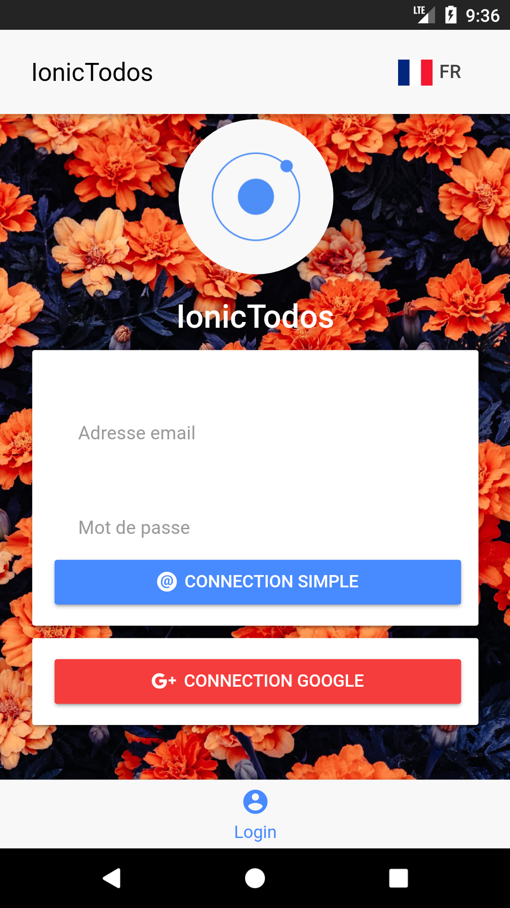
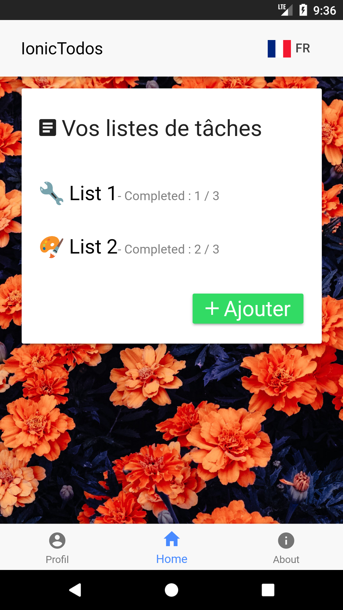

# Projet IONIC-TODO M2GI-MOBILE
M2GI-MOBILE est un projet scolaire ionic cordova permettant de gerer des listes de tâches à faire, telles que des devoirs scolaires, des listes de courses, etc.
L'application réalisée permet également de se lier à un compte GooglePlus afin de partager ses tâches.

## Binôme de travail
- ABELLO Stephen
- DIDIER Clément

## Compilation de l'application
L'application est implémenté uniquement pour tourner sur le système d'exploitation Android. Elle a été testé en version **API 27**.
```sh
ionic cordova build android
```

## Execution de l'application
Execution sur emulateur ou appareil Android (toutes les fonctionnalités) :
```sh
ionic cordova run android
```

Execution sur navigateur (une partie des fonctionnalités) :
```sh
ionic cordova run browser
```

## Fonctionnalités
### Connectivité
L'application donne la possibilité de se connecter avec votre compte ionic-todo, mais également avec votre compte GooglePlus.

### Listes de tâches
L'application vous permet de gérer un ensemble de listes de tâches, dans lequelles il est possible de gérer un ensemble de tâches.

### Multi-langue
L'application gère le multi-langue. Afin d'ajouter une nouvelle langue, il suffit d'ajouter un nouveau fichier JSON dans le dossier "i18n" disponible dans "app/assets" et d'y importer et traduire les phrases d'un autre fichier de langue. Le nom de ce fichier définira le mot clé à employer dans le code source de l'application afin de changer la langue utilisée.

### Screenshots


